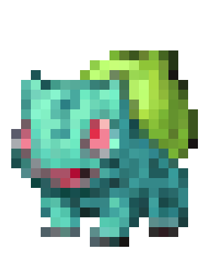
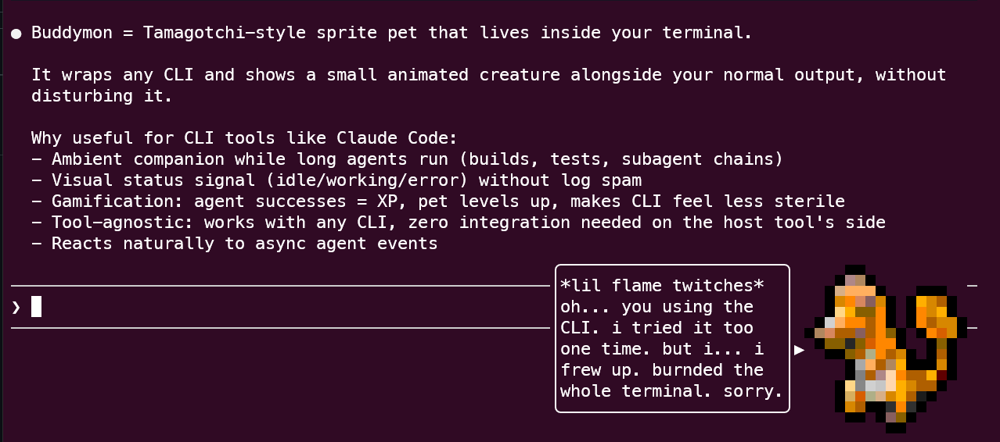

<h1 align="center">buddymon</h1>

  

  
  
  
  <!--  -->

  

  <strong>WIP - First release soon!</strong> 
  <em>Curious where things stand? <a href="https://github.com/Marcel-Bich/buddymon/wiki/Progress">Read the latest progress update</a>.</em>

  A virtual sprite buddy for AI coding CLIs - Claude Code, OpenCode, and friends. 
  Use any sprites you like (custom pixel art, existing sprite sources like Pokemon or whatever you want). 
  Inspired by the original <code>/buddy</code> command, with room to grow into something much more.

  <em>
    Want to help? <strong>Star the repo on GitHub</strong> - it's the best way to show interest and keep me motivated. 
    I'm building at least everything the original <code>/buddy</code> had, and how much further I go depends on community interest ;)
  </em>

## Minimum Goal

Features like the original `/buddy` from Claude Code.

  

  
    Unedited screenshot from a real Claude Code session. This is only an alpha demo to show that it runs end to end. I am already significantly further along behind the scenes, and a lot will still change. The visual style, however, will stay roughly like what you see here.
  

## Maybe

Variety of other features like leveling up, evolution, useful agentic work, etc.

## Platform Support

buddymon targets Unix-like systems:

- **Linux** - primary development platform, fully supported
- **WSL on Windows** - fully supported, recommended for Windows users
- **macOS** - expected to work, not actively tested

**Native Windows (PowerShell) is not planned.** The implementation relies on Unix-only system features that have no native Windows equivalent. If you are on Windows, please use WSL - it provides full Unix compatibility and works out of the box.

## License

This project is licensed under the **Buddymon License v1** - a source-available license that permits personal, educational, and internal use but restricts commercial monetization and code reuse. See [LICENSE](LICENSE) for full terms.

The project name and branding are covered by the [Trademark Policy](TRADEMARK.md).

## Contributing

I'm fine with issues containing code snippets, and I'm not against pull requests, but please read [CONTRIBUTING.md](CONTRIBUTING.md) before submitting anything!  
The contributing rules only exist to prevent licensing issues on my end.

---

## Star History

<a href="https://www.star-history.com/#Marcel-Bich/buddymon&type=date&legend=top-left">
 <picture>
   <source media="(prefers-color-scheme: dark)" srcset="https://api.star-history.com/chart?repos=Marcel-Bich/buddymon&type=date&theme=dark&legend=top-left" />
   <source media="(prefers-color-scheme: light)" srcset="https://api.star-history.com/chart?repos=Marcel-Bich/buddymon&type=date&legend=top-left" />
   
 </picture>
</a>

---

Keywords / Tags

**AI Coding CLIs:** Claude Code, Claude Code Plugin, Claude Code Buddy, Claude Code Extension, OpenCode, OpenCode Plugin, AI CLI, AI Coding Assistant, AI Pair Programming, AI Agent, Agentic CLI, Coding Companion, Anthropic, Anthropic CLI, Anthropic Claude, Anthropic AI

**Concept:** Virtual Pet, Desktop Pet, Tamagotchi, CLI Pet, Terminal Pet, Coding Companion, Buddy, /buddy, Sprite Overlay, Animated Sprite, Companion Bot, Pixel Art, Sprite Viewer, Retro Gaming

**Supported Sprite Sources (examples):** Custom Pixel Art, User-provided Assets and more e.g. Pokemon

**Project:** buddymon, Marcel Bich

